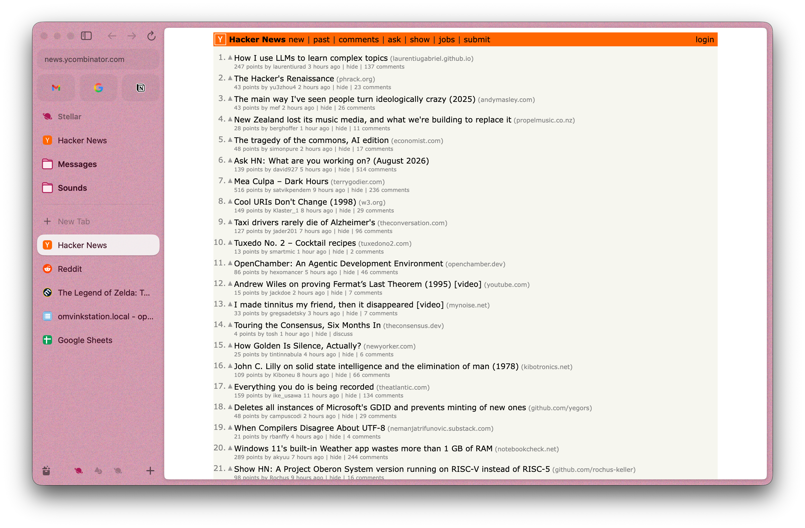
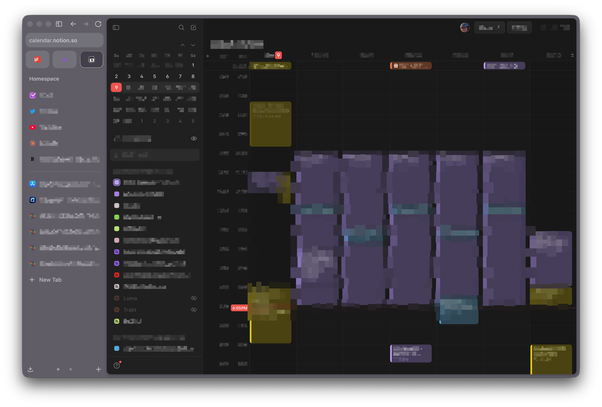
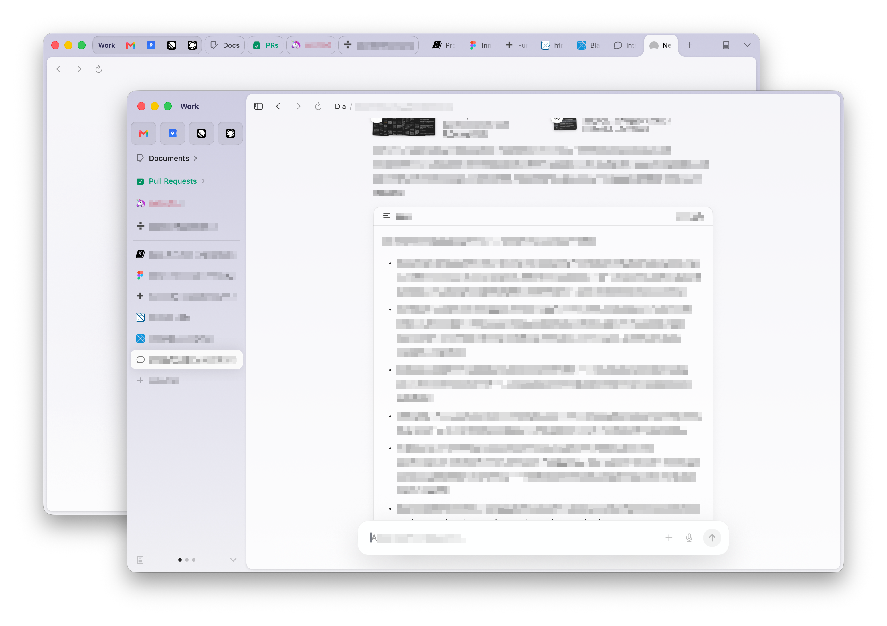
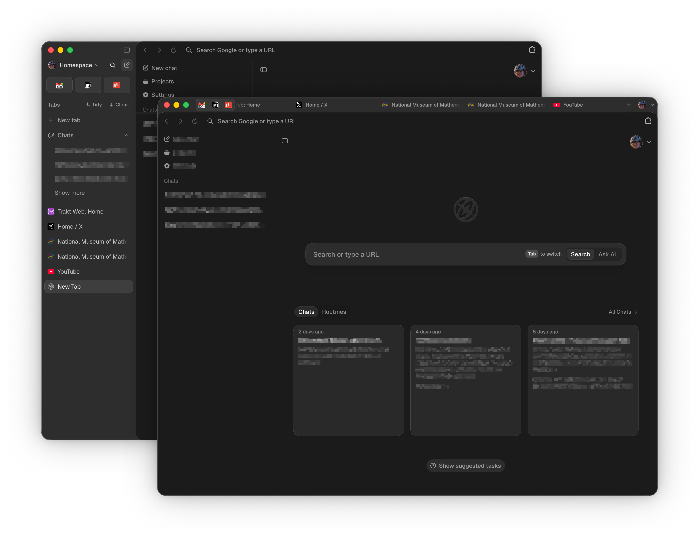

Recently, I've been anxious. Restless. I've been using [Zen Browser](https://zen-browser.app/) as my primary browser for a long while now, but I kept seeing posts on Twitter about these fancy new "AI browsers" like [Dia](https://www.diabrowser.com/) and [Aside](https://aside.com/). Am I missing out? I was curious, so I decided to try them all and write up a comparison! I also wanted to see how they compared to [Arc](https://arc.net/), which all three borrow _a lot_ of design language from. I'm a CS student working a summer internship, so my criteria for "what makes a good browser" are as follows:

- Does it support switching between 3 profiles (work, school, and personal)? Bonus points for further grouping options. I have a lot of tabs.
  - I need to separate my school things out by class/project, and ideally have an entirely separate space for working on code with quick access to my various `localhost` addresses and quick searches.
- Does it support vertical tabs?
- Does it block ads?
- Does it look nice and feel good to use? Visual clutter in my work environment makes it harder to focus.
- Are their AI features worthwhile and well-integrated? Using AI generally means typing out a prompt and waiting... is that effort worth it?
- I care about what works _right now_. 3 out of 4 of these browsers have public roadmaps and are are under active development, but I can't evaluate a feature that launches 3 months from now.

All of these browsers support easily swiping between multiple profiles with tab groups, vertical tabs, built-in adblock, generally good designs, and are available for general use. However, that last criterion about "right now" turned out to be more important than I expected. I started this post as a fear-of-missing-out exercise: everyone on Twitter kept saying AI browsers were the future, and I wanted to know whether I was being left behind. Then, while I was drafting, OpenAI killed ChatGPT Atlas. Not "announced a wind-down," not "moved it to maintenance mode." It stops working today, August 9th, 2026, nine months and change after launch. OpenAI's stated reasoning was that browser-based agentic work belongs in the ChatGPT desktop app and a Chrome extension instead.

So keep that in the back of your mind for everything below. One of these four is already sunset, two are owned by a company that bought them for something else, and the newest is seven weeks old. I'm not really reviewing products here so much as photographing a landslide.

## TL;DR

The answer is: "a little bit of everything". I stuck with Zen as my default, am using Dia on my work laptop, and am keeping Aside as a tool.

# Tonight's Contenders

## Arc

Arc Browser is where it all began. It arguably was the one to popularize vertical tabs after its beta in 2022 and release in 2023, though it was subsequently sunset in 2025. It had a radically groundbreaking design beyond its sidebar with the introduction of Spaces: different Chromium profiles contained within the same window to separate cookies between different spheres of life (such as work and personal). As though that weren't enough, it also eliminated the entire concept of the New Tab page, and ditched bookmarks in favor of Pinned Tabs and Essentials. Arc felt like a true rebuild of the browser from first principles, and these changes are just the most visible examples out of hundreds of others. Because all of the following browsers are clearly _trying_ to emulate Arc's design in some capacity, Arc sets the benchmark for them too.

Pros:
- The sidebar is a revolutionary workflow, and Arc still does it best out of all of these options, though Zen comes close.
- More polished experience than Zen, even after all Zen's years of development.
- Even though it is sunset, it's still perfectly usable and gets Chromium version bumps weekly.
- The AI makes life better. It renames tabs to make them more succinct, renames downloads to what they actually are, and does other small things for you. It isn't at the top of every tab, nor does it take over your new tab screen.

Cons:
- **Arc isn't for everyone.** Many people loved it, including me, but it can feel alien and unintuitive because it is so different. Not everyone wants to worry that their unpinned tabs will disappear after 24 hours. 
- It is sunset and will not receive any new features. Their parent company, The Browser Company, was [acquired by Atlassian](https://x.com/browsercompany/status/1963579501129978167) about a year ago. It has no engineers on it, and its long-term survival now depends entirely on how long Atlassian deigns to keep it around.
- Arc actively makes it hard to leave: There's no built-in way to export bookmarks, cookies, or history.
- The Windows version is missing a lot of features and polish present in the MacOS version and is, in general, not very good.
- Some features (Easels) are, in practice, just gimmicks.

In summary: Arc is still very usable right now, almost a year after it was sunset, and I don't begrudge my coworkers that are still on it. But I would have reservations about switching to it right now, since its future is uncertain while Zen and Dia have approached feature parity.

## Zen

Zen Browser is an open-source Firefox fork that released in 2024. It strives to mimic Arc's design and features in an open-source shell, and has largely done so. It's proven incredibly popular, with >500,000 users and 40k GitHub stars as of August 2026, while also being one of GitHub's fastest-growing projects by contributor count. Although it's still in beta, the browser is relatively stable.

Pros:
- Zen is open-source, which means that it will likely remain free and maintained for years to come. This is the browser I'm most confident will still exist in 3 years.
- It doesn't require an account before the browser can even open, unlike the other three. It's compatible with Firefox Sync, but this feature is optional. 
- It's important to support Firefox-based browsers to prevent Google from gaining total market dominance. Also, the full version of uBlock Origin works.
- Of these browsers, Zen seems to perform the best and is lightest on my battery... on MacOS. I also used Zen on a Windows laptop for a couple years without problems, but these other browsers can't really compete there.
- It's the closest to a feature-for-feature duplicate of Arc, including niche features like boosts. Peek, Live Folders, regular folders with icons, etc, are all here.
- It can split more than two tabs, and in more complex layouts than "a bunch of columns".
- It uses per-tab Firefox Containers to separate tabs instead of wholly separate Chromium profiles to separate cookies. This means you don't have to reconfigure your extensions on each profile, you can mix and match containers in the same Space, and it's a more lightweight system overall.
- Fully-featured Windows version.

Cons:
- Zen isn't for everyone either. It retains more features from Firefox- Bookmarks are still here, and your tabs don't get closed automatically, but it is still built for a specific type of person.
- Arc was special because it was opinionated, but Zen lacks the ambition to do more than emulate Arc. Now that they are ~95% feature complete, I suspect development will generally slow down.
- It's still missing some minor features from Arc: Little Arc, Easels (who cares), and development mode on localhost sites.
- Doesn't sync open tabs between devices (the other three offer this to varying degrees).
- No AI whatsoever: No sidebar to ask AI about the page, but there's also no tab tidying, group naming, download renaming, etc. I'm fine without those features, but lacking them is what sent me off on this journey.
- No mobile app. However, you can send tabs and sync history from your phone using the Firefox app.

## Dia

Dia is the second browser from The Browser Company of New York. It was launched in 2025 as a response to two major things: They wanted to make a browser with AI as the core primitive, and Arc was struggling to gain mass adoption due to its complexity. Dia returns to a more standard layout with a horizontal tab bar, a new tab page, and a bookmark bar, while retaining the option to return to an Arc-style sidebar. This horizontal bar carries over many previously-exclusive features from Arc's vertical strip, like decorations on pinned tabs and live groups for documents and GitHub pull requests.

Pros:
- Very polished experience, as in Arc. Cool animations abound, and the core workflows are clearly well thought-out.
- The documents its AI makes are well-researched and visually stunning. Unfortunately, I have very little need for them, but it's cool they exist.
- The Morning Brief that pulls from my Slack and work email to create a to-do list and summarize updates is pretty cool.
- Automatic tab groups + group names via AI is super slick.
- There are, once again, some thoughtful AI features (like download renaming and `/path/summarization`) that are not present in the competition.

Cons:
- The inbuilt agent is strictly limited to read-only actions on a tight set of supported apps and your open tabs. No MCP, only written outputs. Claude and ChatGPT can already answer questions about individual articles, Slack, and my email.
- The Atlassian acquisition seems to have made Dia focus on specifically being useful for enterprise. It hasn't shipped any particularly noteworthy features for personal or student usage in recent months, and the AI is even more useless if you don't connect it to your enterprise tools.
- Multiple windows work weirdly. Pinned tabs and groups stick around, but unpinned ones don't. Closing all tabs in one window in one profile closes the rest of the tabs in other profiles in that window. In Arc and Zen, all tabs are present in all windows.
- Unclear business model. There's literally no way to give them money or change the model that the AI uses.
- Limited customization. You can choose one of 8 colors and that's it.
- Glacial pace of development. It's been out for a year and the sidebar is only now approaching what it used to be in Arc.
- Performance feels alright on my Mac, but I've noticed hiccups with tabs that get in a state where they won't load until closed & reopened.
- Missing lots of features from Arc: Swiping between profiles was _just_ added (and they made a weirdly big deal about it), there's no Peek or Little Dia.
- No Windows or mobile support, though the former is coming eventually. Given how bad Arc's Windows support was, I'm not holding my breath.

## Aside

Aside is a recently-launched AI browser that claims to have an extra-special harness that's less like a chatbot and more like a coding agent (in fact, it literally runs on Pi agent, the same agent backend powering OpenClaw). Paired with tools that let it control the browser using JavaScript, it claims to be able to handle much more complex tasks than competing products. However, the launch with ~5K likes on X pulled a mere 2 comments on Hacker News, one of which was literally "5k likes on X and not a single comment here." For a technical audience, the absence of engineer-to-engineer scrutiny is worth noting. 

I have a confession, too: I only heard about the browser because it launched shortly after my own webapp, also called [Aside](https://github.com/the-snesler/aside). I suppose we both asked Claude for name ideas?

Pros:
- Incredibly powerful agent that can actually _do_ things across several sites and tabs. I've had it successfully research flight transfer times, draft emails, find and book comedy shows, and fill out the rote parts of job postings (I still do the writing). It's magic, and a total game-changer.
- It can reuse your existing AI subscriptions from OpenAI, Anthropic, and friends, so you can use more powerful models than whatever no-name model Dia uses, and therefore gain more control over the experience.
- There's genuinely impressive architecture work going on here. They've reached into Chrome and made the path for its agentic use very smooth in a way no other browser has.
- The built-in password manager is surprisingly feature-complete and entirely free. It's much more comparable to something like 1Password than the built-in password managers in other browsers. It has hardware-backed encryption and a cool "agent never sees the raw password" design (it's not the agent provider I'm worried about, though).
- The "Memory" system (yes, another one) is refreshingly transparent by AI-agent standards: it's a bunch of plain editable markdown files in folders that are updated via a background "Dreaming" process. You can literally open and correct the file when the agent remembers something wrong.
- It's (mostly) local-first by design. The transcripts and artifacts live in a local directory, so your hosted model providers only get the context needed for a given task, and you can choose where a job actually runs.

Cons:
- For the full experience, you have to give their AI the keys to the kingdom (your password manager). They also sync your cookies between devices, and Routines are run with your logins on their servers in the cloud. They claim it's encrypted, but **this is still placing an _enormous_ amount of trust in a random startup**, in an age where LLM-exploited vulnerabilities are omnipresent.
- Regardless of whether we think their sync infrastructure is secure, the AI is eternally on YOLO mode. It has your deepest secrets and is also reading unfiltered comments from Reddit. There is an option to "ask for permission before writing", which seems to work, but it isn't mechanically enforced anywhere.
- While the website claims the password manager has "scoped access" and an audit log, I don't see either of those things in the product itself. Scoped access to credentials is mostly meaningless when the agent already has my session token anyway. The only time an agent has asked me for permission to log in so far was when it couldn't interact with a Google oAuth popup.
- It is clearly vibecoded to hell and back. This is a 5-person YC startup and they're competing with teams orders of magnitudes larger.
- Unclear business model. They have a subscription that appears to cover AI inference _and_ some cloud compute, but also allow users to bring their own ChatGPT/Anthropic subscriptions for local use. $20/mo is steep for a browser, though.
- Aesthetics need more time in the oven. I have many minor nitpicks, but most notably: Horizontal tabs don't shrink and instead scroll. I can only have ~5 on screen at once. The vertical tab bar has a mandatory "Chat" dropdown, bookmarks that are halfway in between Arc and Chrome, headers that make no sense, and so on. 
- Tabs don't seem to be unloaded ever, and the tabs used by the agent are open in the background for a long time. I ran out of memory with only 10 tabs visible.
- No Windows or mobile support, though the former is coming soon (allegedly before Dia).
  - A feature called "channels" is in preview, which would let you text Aside from your phone (via Discord, Slack, etc) and allow it to perform tasks on your behalf.

# Arc vs. Zen

Now that Arc is frozen, this comparison has basically flipped from "which one is more polished" to "which one has a future." Arc is a finished sculpture; Zen is a living project trying to catch up to it (and surpass it, I hope!)

**Arc wins:**
- Refinement. Years of first-party polish show in the small stuff: spacing, animation timing, and interaction details that Zen hasn't fully matched yet. Some longtime users describe Zen as feeling "slightly rougher," "more cramped."

**Zen wins:**
- It's alive. Arc gets Chromium version bumps; Zen gets actual new features from an actual team.
- It's open source (MPL 2.0) versus Arc's closed, now-orphaned codebase. If Atlassian ever kills Arc outright, there's no community fallback. If the Zen team disappeared tomorrow, the code still exists for someone to fork.
- Firefox Containers instead of full Chromium profiles (as I mentioned in the original Zen section) is a way better architecture for how I actually use Spaces day to day. It's meaningfully lighter on RAM.

Overall: if you're already on Arc and it still does everything you need, there's no fire alarm. It'll keep working and keep getting security patches for a while. But if you're choosing fresh in 2026, picking Arc means picking a museum piece. **Zen is the only one of these four that's successfully trying to be Arc _and_ has a pulse.**

# Dia vs. Aside

These are the two "AI browsers" in the lineup, but they're solving fundamentally different problems. Dia is an assistant. It reads your tabs, summarizes, drafts, and writes, but it fundamentally does not act on your behalf. Aside is an agent. It logs into real sites with your real credentials and takes real actions: booking things, filling out forms, sending emails, running for minutes or hours unsupervised.

**Dia wins:**
- Refinement, again. Aside is a kickass agent with a browser tacked on, Dia is the opposite: a great browser with a chatbot tacked on. Dia has had a bit over a year since release to sand off rough edges, while Aside launched less than a month ago.
- Backing: Dia has Atlassian's balance sheet and enterprise distribution behind it. They're apparently recruiting for an enterprise tier. Aside is a 5-person YC startup a few months old with no published pricing. If the metric is "which one exists in 3 years"... frankly, neither option is compelling, but Dia edges out.
- Data security: Aside mandates syncing all your cookies and passwords through their cloud. It's required for their architecture to work, but that's a _lot_ of faith to put in such a small team. A breach would be disastrous. Dia's privacy policy isn't immaculate, but Atlassian having all my data feels better than the dark web having all my data.

**Aside wins:**
- The agent: I don't care that their self-reported benchmarks haven't been reproduced, right now it's truly something special. If you're fine with letting Claude go ham with your accounts, Aside is unequivocally the best place to do so.

Overall: Dia is the safer bet if you want AI woven into a stable, backed-by-a-real-company work browser and you're fine with it not actually doing anything for you beyond reading and writing text. Aside is more exciting if you want a "browser that browses for you", and you're willing to accept startup-grade risk (and hand over a genuinely alarming amount of access) to get it. **Neither is done cooking.**

# AI Browser Honorable Mentions

If it's not clear from the examples I chose, I'm only really interested in browsers with vertical tabs (sorry!). Here are my impressions of other "AI Browsers" though:

- ChatGPT Atlas (RIP, as of today): OpenAI announced the sunset on July 9th and pulls the plug on August 9th, 2026, nine months after launch. It was neat, but never usable as a primary browser. Dia made some UI innovations (that Aside then borrowed) that make both of those options far more ready for primetime. Its capabilities now live on in the ChatGPT desktop app and, tellingly, a Chrome extension. If you're somehow still running it, go export your bookmarks.
- Google Chrome: Gemini fundamentally does a lot of what Dia tries to do (and with Agent mode, even more), but Dia's UI/UX is a lot better. Aside can operate across bigger tasks.
- The Claude Chrome extension: same as Gemini, it can accomplish a lot of the same things, but doesn't seem as consistent as Aside. Uses a ton of tokens.

# Feature-by-feature comparison

| Feature | Arc | Zen | Dia | Aside |
|---|---|---|---|---|
| Engine | Chromium | Firefox / Gecko | Chromium | Chromium |
| Active development | No | Yes | Yes, but slow pace. | Yes, but tiny team |
| Open source | No | Yes (MPL 2.0) | No | No |
| Vertical sidebar tabs | Yes (the original) | Yes | Yes (added post-relaunch) | Yes (messy) |
| Spaces/Profiles for separating contexts | Yes (Spaces + Profiles) | Yes (Space + Containers) | Yes (Spaces + Profiles) | Yes (Spaces + Profiles) |
| Split view | Yes (2 tabs) | Yes (grid layout) | Yes (column layout only) | Yes (2 tabs) |
| Tab sync across devices | Yes | No (Firefox Sync only) | Yes | Yes |
| AI sidebar / chat | No | No | Yes, core feature | Yes, core feature |
| AI can take real actions (not just chat) | No | No | No, read-only | Yes, full agent |
| Bring your own AI subscription | No | N/A | No | Yes (OpenAI, Anthropic, etc.) |
| Built-in password manager | Yes (Chrome) | Yes (Firefox) | Yes (Chrome) | Yes (homegrown) |
| Privacy | Medium (Chromium telemetry) | Strong (Firefox-based) | Weak (AI data collection) | Weak (syncs all browsing data) |
| Windows support | Yes, but rough | Yes, on par with macOS | Soon | Soon |
| Mobile support | Yes | No (Firefox Sync client only) | No | No ("channels" in preview) |
| Extension ecosystem | Chrome Web Store | Firefox add-ons | Chrome Web Store | Chrome Web Store |
| Business model | Dead | Free | Unclear | Freemium ($20/mo) |
| Backing | Atlassian | Community | Atlassian | YC-backed |

# Conclusion

All of these browsers are very capable and excel in one way or another, but I'm realizing that AI features are not the most critical lens through which we should evaluate software (much to the chagrin of various venture capital firms, I'm sure). For example, I could never see myself using Aside as a daily browser due to all the UX papercuts I encountered during testing, even though these so-called "AI browsers" benefit from regular use by being able to reference my search history. Reading through their privacy policies also made me wonder if I should really be so cavalier about bringing my data into these ecosystems, too. 

Atlas is the most straightforward version of this argument, and I swear I'm not bringing it up twice just for the drama. OpenAI had more money, more model access, and more distribution than every company in this post combined. They shipped an AI browser, ran it for nine months, and concluded the browser was the wrong container for the idea. What survived wasn't the browser, it was a Chrome extension that does half as much. The demand justifiably isn't there. Meanwhile, the browser I'm actually keeping (spoiler) is the one with no AI in it whatsoever, built by volunteers, on the engine everyone keeps writing obituaries for.

So where did I end up with these options? I'm using **Dia** for my work laptop this summer. Overall, if you're coming from Chrome or another standard browser, Dia is a great place to start. It has tons of very nice UI/UX touches, but the AI chat is holding it back. I love the Morning Brief too much to give it up. I've chosen to keep **Aside** installed for the tasks it is uniquely capable at executing, but I won't be using it as my default browser, and I won't be using the vertical tabs either. But I think there's a technical moat here in a browser built for an AI coding agent, and I'm very interested to see where it goes. **Arc** is a non-starter due to the difficulty in exporting data, and uncertainty about its future. Finally, **Zen**, as the true successor to Arc, remains my default. Windows support ended up being a truly killer feature for use on my desktop, and the AI features of the other browsers aren't useful enough to justify porting everything over.

So this whole exercise ended in a no-op for me, which felt anticlimactic until I realized that "the incumbent was fine, actually" is the same conclusion OpenAI reached about their own browser, and millions of others who don't care about browsers reach every day. I hope others might find this post helpful for making their own comparisons!
