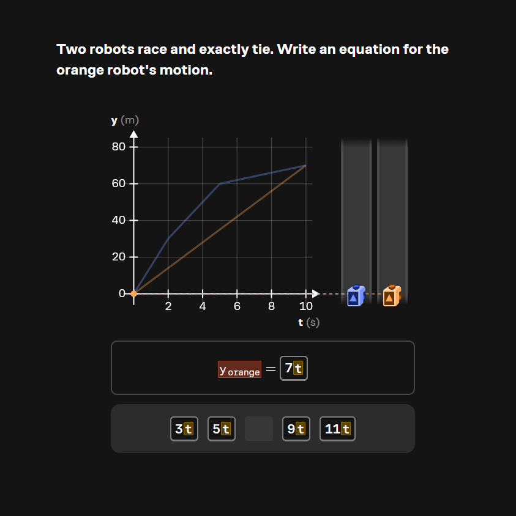

tl;dr: This summer, I learned [Elm](https://elm-lang.org/) from scratch at [Brilliant](https://brilliant.org/), extended its symbolic math system to support sets and intervals, and migrated its equation graph to a new math representation. I also built animated graphs for the [Derivatives course](https://brilliant.org/courses/derivatives/derivatives-1/aroc-1/). The hardest part was finding a way to make a foundational change while other engineers kept building on the same system. That meant finding a migration boundary, making the changes reviewable, and improving the checks we used before shipping.

If you aren't familiar with Brilliant, you may know them as "[today's](https://www.youtube.com/watch?v=JstW96GM1TQ) [sponsor](https://www.youtube.com/watch?v=wo_e0EvEZn8), [Brilliant.org](https://www.youtube.com/watch?v=RpslsMqPFWA)" from your YouTube creator of choice. Their primary product is hands-on digital lessons in STEM topics, especially math and programming. I joined the Interactives team, which meant I got to work on the graphs, charts, and visualizations that learners interacted with!

# Sets, intervals, and a new stack

My original project was to support new problem types based on numerical sets and intervals. Lesson authors needed to write these as mathematical expressions, the symbolic math system needed to operate on them, and graphing and number-line components needed to render them.

Thankfully, parsing math isn't terribly different from parsing code! I had just finished taking a course on [compilers](https://pages.cs.wisc.edu/~hasti/cs536/), so I had a starting point even while learning Elm and the codebase. Some questions still needed input from the people writing lessons: $(0, 1)$ could be an open interval or a coordinate, for example. Talking with our learning engineers helped me understand which ambiguities mattered in practice and which we could document without blocking the work.

The symbolic operations took more thought than I initially expected. A finite set can look a lot like an array of values, but intervals can contain infinitely many numbers, have unbounded endpoints, and appear inside other sets. Adding support meant working through how those cases affected the existing operations, with both pre-existing and new unit tests to check the results.

One distinction that took some discussion was a set *containing* an interval versus a union with that interval. $\{1, [2, 3]\}$ contains two elements: a number and a set. $\{1\} \cup [2, 3]$ contains the number 1 and every number in the interval. Those expressions look similar, but flattening the first into the second would change its meaning. The representation had to preserve that distinction through parsing and evaluation.

A small-looking representation choice could determine whether we preserved what a lesson author actually meant. After a few weeks, the new parser and symbolic operations supported sets and intervals. Getting that work into the equation graph was a larger project.

# Finding a migration boundary

The equation graph still relied on a legacy parser. Its math representation flowed through the package: it was used to evaluate functions, render equation labels, and communicate with other interactive components. To use the new parser, I needed to understand those connections well enough to change them while the graph remained usable.

The two representations also divided responsibilities differently. The old one combined information for rendering equations and operating on their mathematical meaning. The new system separated those concerns into two data types. Neither new type could replace the old one everywhere, so the migration required deciding what each caller actually needed.

My first attempt used a coding agent to migrate the package in one pass. It exposed a problem with the scope I'd chosen: the change spread into connected packages and produced a diff far too large to review reliably. Meanwhile, teammates were continuing to change the graph, making the branch difficult to keep current. Even fixing the implementation wouldn't have made that a practical way to ship it.

My mentor suggested the [Strangler Fig pattern](https://learn.microsoft.com/en-us/azure/architecture/patterns/strangler-fig): gradually replace parts of the old system while keeping the rest working. At first, I couldn't see where to apply it. Legacy math appeared throughout the graph's main path, and I couldn't find a whole feature to peel off independently. I needed to look more closely at where the representations crossed between components.

## Letting old and new code coexist

With help from an agent, I traced how math entered the graph, where it was held in state, and which components consumed it. Elm's module dependencies gave me a starting point, but I also needed to follow the actual data flow. That let me distinguish pieces I could migrate separately from pieces that needed to change together.

The workable boundary was a compatibility layer that translated the legacy representation into the new one by walking its abstract syntax tree (AST). With that conversion available, a component could accept translated input while its callers still used the old representation. I could migrate a connected group of components without also migrating everything upstream of it.

My mentor had been right about Strangler Fig after all! I had been looking for an isolated feature, and the translation layer gave me a boundary within the existing data flow. It also made the conversion itself a bounded task that I could test thoroughly.

I used that analysis to set an order for the migration, then asked an agent to help implement it in independently reviewable commits with access to the checks it needed. This produced a useful baseline, but there was still substantial work before it could ship. I read through each layer, tested it, reorganized code, removed duplicated helpers, and worked through feedback from my colleagues.

The migration became a stack of 15 PRs. As the lower layers passed checks and review, I could merge them and let teammates build on the updated code. That reduced the amount of work sitting on a separate branch and made it easier to accommodate changes happening around mine. Breaking up the migration helped with both review and collaboration.

## Checking more than the picture

The team's existing tests made this possible. Browser-based checks compared rendered interactives, and validation checks helped catch compile-time and runtime failures. I leaned heavily on them to find changes in behavior and appearance while replacing the internals. Every PR passed CI and review by my colleagues before merging.

Performance needed more visibility. During the migration, a graph evaluation bug surfaced as a timeout elsewhere in the tests, which made the cause difficult to identify. A screenshot comparison couldn't explain why the graph was taking too long.

I updated the browser tests to collect and compare timing and memory usage alongside their screenshots. That gave us more information when investigating regressions. A graph could look right and still have a problem; I wanted the checks to tell us more about what happened while producing that picture.

## Preserving the learner's experience

Some migration decisions also needed product judgment. What should a graph show while a learner has entered an incomplete equation like `y = 2x + ?`? We had to decide how much to infer about the missing part.

We settled on filling missing numeric slots with 0 and leaving other missing parts empty. Inferring more wasn't necessarily helpful for the learner and could even give an answer away. Reproducing the old behavior wasn't automatically the right goal: we needed to consider what the graph should communicate while someone was still working out an answer.

That decision depended on conversations about how the interactive was used. Understanding the types and getting an expression to evaluate were only part of understanding what the graph needed to do.

## Where it landed

The migration finished with about two weeks left in my internship. The graph no longer depended on the legacy parser. Other interactives could continue using the old representation and translate it before passing math into the graph, so they didn't all have to migrate on the same schedule.

Lesson authors supplied equation strings, so most existing interactives didn't need changes. Equations that weren't valid under the new parser were exceptions. Separating the structures for rendering and evaluating math also simplified the callers and reduced the amount of code.

As far as I know, the new sets-and-intervals problem types and number-line work are still in progress, with the new content intended to replace Brilliant's existing sets material. My work extended the symbolic math support and completed the equation graph migration; the broader content work continued beyond my internship.

# Animated graphs for lesson authors

With the remaining two weeks, I worked on MotionGraph, a new package for animated graphs for the Derivatives course. This was a chance to build an author-facing API after spending much of the summer working underneath an existing one.

Before building the package, I wrote an API design doc and asked my colleagues and lesson authors for feedback. This caught some fairly basic things early: several of my names weren't standard terminology, and parts of the API were more verbose than they needed to be. Since these were the people who would use it to build lessons, that was useful to discover before I had an implementation to defend.

The package combined reusable graph elements with different visual presentations and input components. Keeping those pieces separate let each presentation contain its own logic while composing with the rest of the graph. For several input types, I could lean on patterns already in the codebase.

General keyboard input was harder. An equation alone didn't tell me what kind of question an author wanted to ask, so trying to infer the interaction from the equation text would leave too much implicit. I constrained the API to a set of supported problem types. That meant less freedom, but authors could explicitly specify the kind of interaction they wanted.

The resulting animated graphs are used in the Derivatives course, including the example at the top of this post. The course released after I handed off the package, so my part was building the package and its authoring API before that release.

# Takeaways

I think the biggest reason the migration succeeded was the team's investment in testing infrastructure. They gave me some peace of mind while changing the internals, made the PRs easier to review, and gave the agent a way to check its own work while I wasn't watching it. Extending those checks taught me to look beyond whether the output was correct to how the system produced it. Good tests make both engineers and agents able to move faster and more confidently.

"Aiming before firing" feels more important than ever with agents. You can leave one working for hours, but if you underspecified the task or didn't think through the implications of the prompt, it can spend all that time pursuing the wrong thing. I still needed to learn Elm and understand the system well enough to judge what came back. My first attempt at the migration was a pretty good demonstration! The later attempt had a translation boundary, an order to work through, tests the agent could run, and a requirement to split the work into reviewable pieces. I'd spend more time up front tracing dependencies, finding a boundary, and deciding what the checks need to establish. 

You can't expect an agent to read your mind. People who've spent time at a company develop a general vibe for what a good solution looks like: what authors will find confusing, what reviewers will accept, and what behavior makes sense for a learner. We probably couldn't verbalize all of that well enough to fit it into a prompt even if we tried, and an agent's context window only holds so much. I think this is a lot of what people mean by "taste." Design fundamentals are part of it, but so is all that accumulated context about who you're building for and what matters to them.

Next time, I'd spend more time up front identifying those decisions, deciding what the tests need to establish, and making the boundaries of the task explicit. I suspect this is a similar takeaway to what junior engineers would've had from pre-AI internships, which is a small comfort. The agent saved me a lot of mechanical work once I had those pieces in place. Understanding what we actually wanted to ship still took conversations with my mentor, colleagues, and lesson authors.
